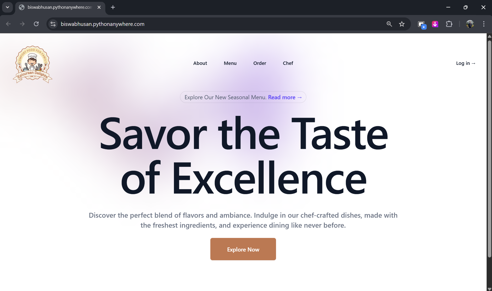
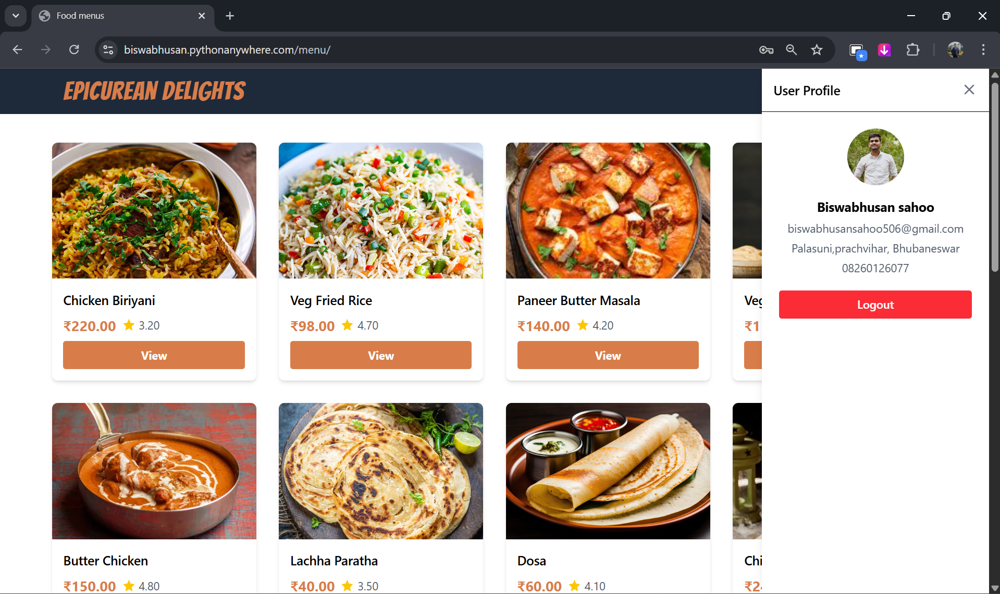
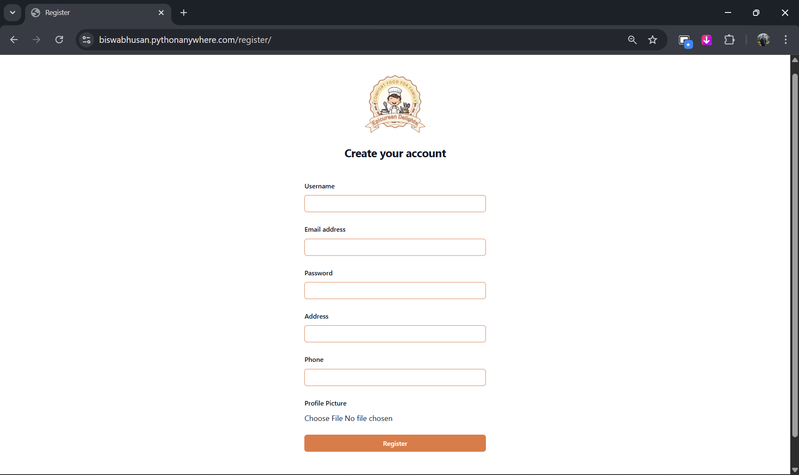
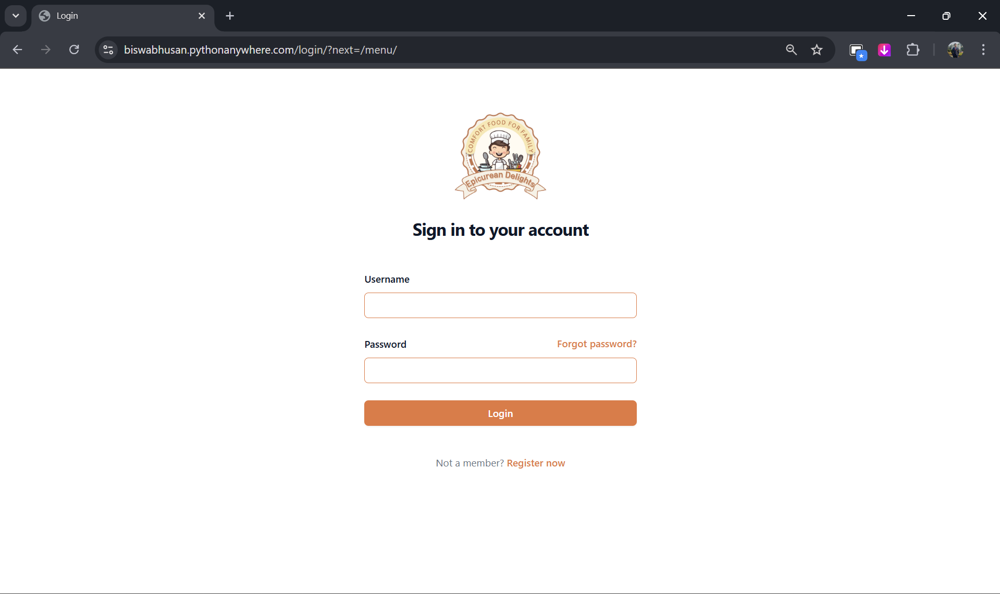
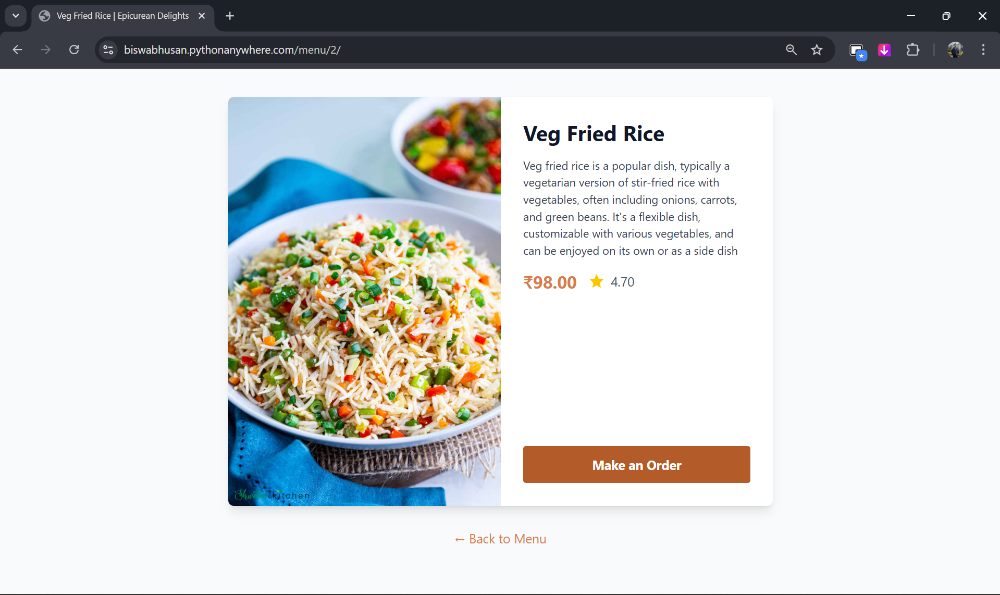
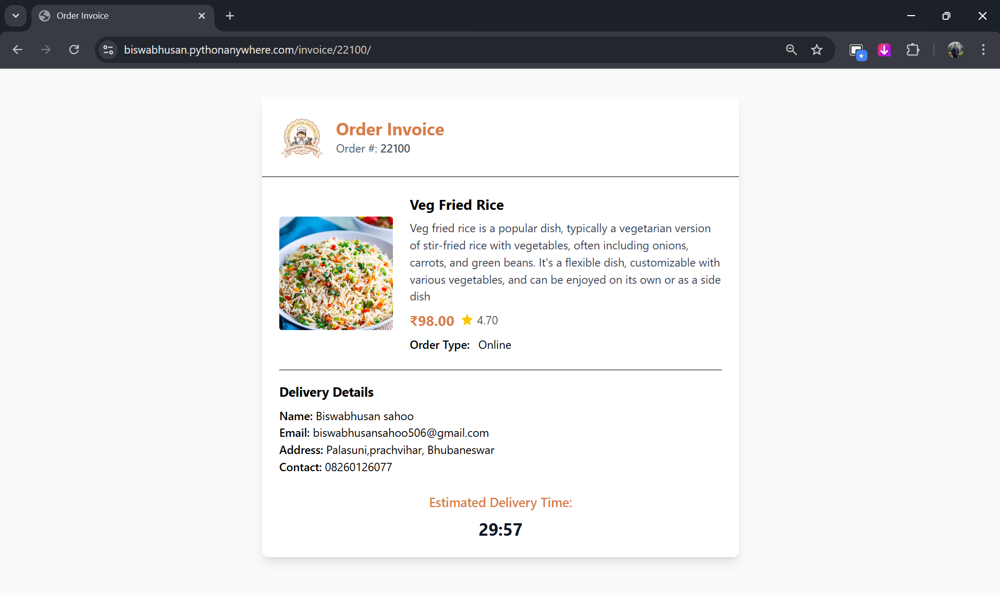
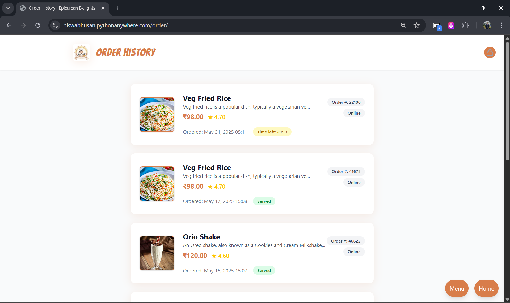
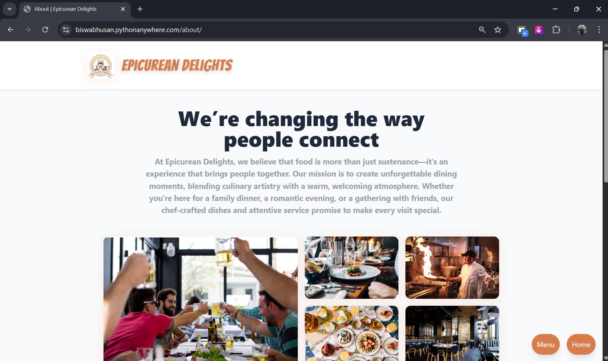

# Django-Resturant-app

<h1 align="center">
  🍽️ <span style="color:#d87d4a;">Epicurean Delights</span> - Django Restaurant App
</h1>

<p align="center">
  
  
  
  
  
</p>

<p align="center">
  <b>A modern, full-featured restaurant web app for online food ordering, built with Django, Tailwind CSS, and JavaScript.</b>
</p>

---

## 🌐 Live Demo

🔗 **[View the live site here!](https://biswabhusan.pythonanywhere.com/)**

---

## 🌟 Features

- 🏠 **Home Page**: Beautiful landing page with hero section and navigation.
- 🍲 **Menu Browsing**: View all menu items with images, prices, and ratings.
- 🔍 **Menu Details**: See detailed info and images for each dish.
- 🛒 **Order System**: Place orders online or choose Cash on Delivery.
- 🧾 **Invoice Generation**: Get a detailed invoice after each order.
- 📧 **Order Confirmation Email**: Receive a styled HTML invoice in your inbox.
- 🗂️ **Order History**: View all your past orders with status and timers.
- 👤 **User Registration & Login**: Secure authentication with profile picture upload.
- 📝 **Profile Sidebar**: Slide-out user profile with address, phone, and logout.
- 👨‍🍳 **Chef Showcase**: Meet the chefs with bios and customer testimonials.
- 🏢 **About Page**: Learn about the restaurant, developer, and location.
- 📱 **Responsive Design**: Fully mobile-friendly and modern UI.
- 🖼️ **Image Uploads**: For menu items and user profiles.
- 🔒 **Secure**: Uses Django's authentication and CSRF protection.

---

## 🖼️ Screenshots

### 🏠 Home Page


### 🍲 Menu Page


### 🔍 Menu Details
*Menu details are shown on the menu page and in the order flow.*

### 👤 User Authentication
**Register:**  


**Login:**  


### 🛒 Order System
**Order Placement:**  


### 🧾 Invoice Generation


### 🗂️ Order History


### 👨‍🍳 Chef Showcase & 🏢 About Page
**About Page:**  


> _More screenshots available in the `SC` folder._

---

## 🛠️ Tech Stack

- **Backend:** [Django 5.2.1](https://www.djangoproject.com/)
- **Frontend:** HTML5, [Tailwind CSS](https://tailwindcss.com/), JavaScript
- **Database:** SQLite (default, easy to switch)
- **Email:** SMTP (Gmail or custom)
- **Image Handling:** Django Media Files, Pillow

---

## 📦 Installation

1. **Clone the repository**
   ```bash
   git clone https://github.com/Biswa-source45/Django-Resturant-app.git
   cd Django-Resturant-app
   ```

2. **Create a virtual environment**
   ```bash
   python -m venv .venv
   .venv\Scripts\activate
   ```

3. **Install dependencies**
   ```bash
   pip install -r requirements.txt
   ```

4. **Configure environment variables**

   Create a `.env` file in the root directory:
   ```
   SECRET_KEY=your-django-secret-key
   DEBUG=True
   EMAIL_HOST_USER=your-email@gmail.com
   EMAIL_HOST_PASSWORD=your-email-password
   ```

5. **Apply migrations**
   ```bash
   python manage.py migrate
   ```

6. **Create a superuser (admin)**
   ```bash
   python manage.py createsuperuser
   ```

7. **Run the development server**
   ```bash
   python manage.py runserver
   ```

8. **Access the app**
   - Visit [http://127.0.0.1:8000/](http://127.0.0.1:8000/) in your browser.

---

## 🖼️ Media & Static Files

- Place your static files (CSS, JS, images) in the `static/` directory.
- Uploaded images (profile pictures, menu images) are stored in `media/`.

---

## 📧 Email Setup

- Uses SMTP for sending order confirmation emails.
- Configure `EMAIL_HOST_USER` and `EMAIL_HOST_PASSWORD` in your `.env`.
- For Gmail, you may need to enable "App Passwords" or "Less Secure Apps".

---

## 🗂️ Project Structure

```
ResturantPRJ/
├── core/
│   ├── migrations/
│   ├── templates/core/
│   ├── static/
│   ├── models.py
│   ├── views.py
│   └── ...
├── ResturantPRJ/
│   ├── settings.py
│   ├── urls.py
│   └── ...
├── media/
├── requirements.txt
├── .env
└── README.md
```

---

## 👨‍💻 Developer

- **Biswabhusan Sahoo**  
  [](https://www.linkedin.com/in/biswabhusan-sahoo-22b704292/)  
  [](https://github.com/Biswa-source45)  
  📧 biswapvt506@gmail.com

---

## 📝 License

This project is licensed under the MIT License.

---

## 🙏 Acknowledgements

- [Django](https://www.djangoproject.com/)
- [Tailwind CSS](https://tailwindcss.com/)


---

## ⭐️ Show your support

If you like this project, please ⭐️ the repo and share it!

---

<p align="center">
  <b>🍛🍕🍰</b><br>
  <b>Thanks for showing interest in this project. Happy coding! 🚀</b>
</p>